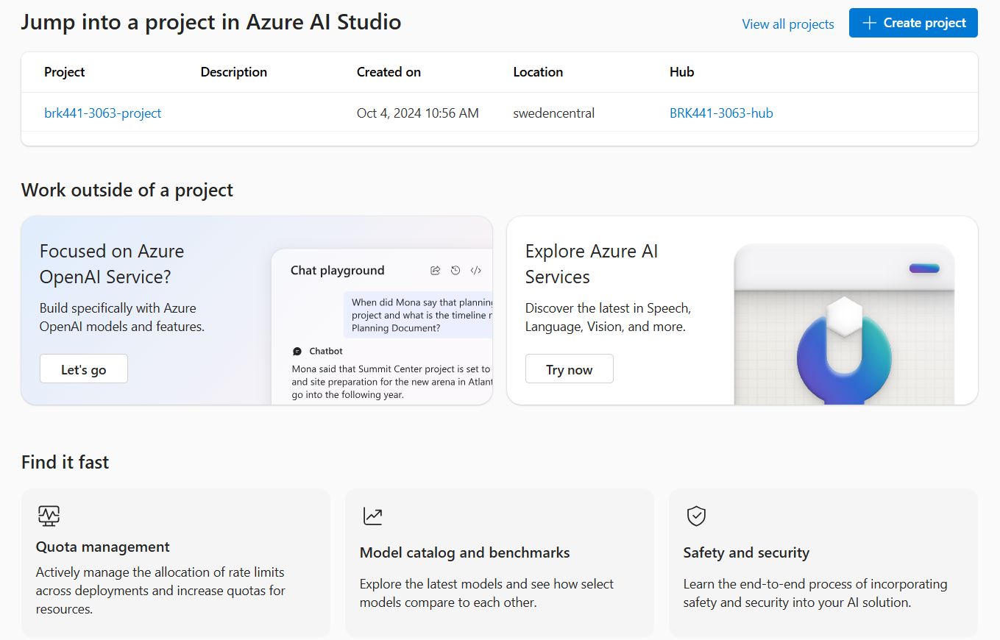
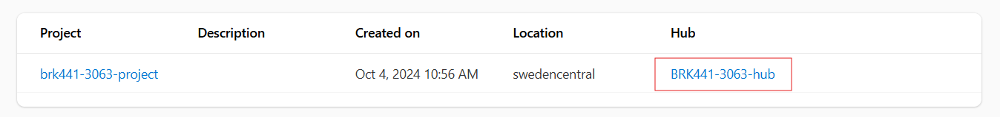
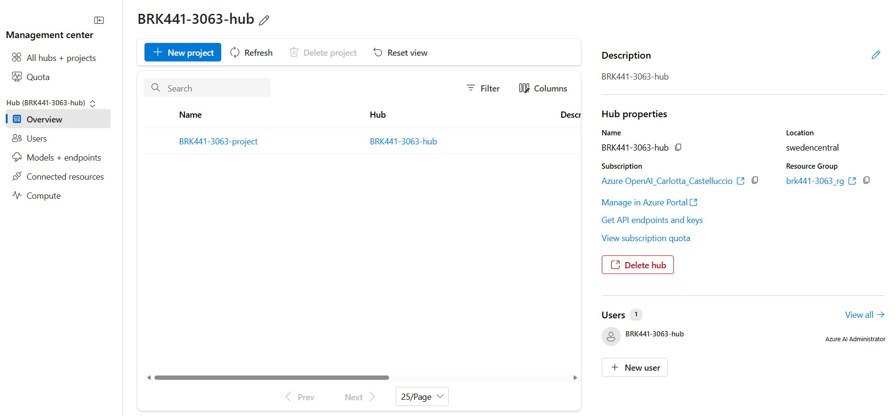
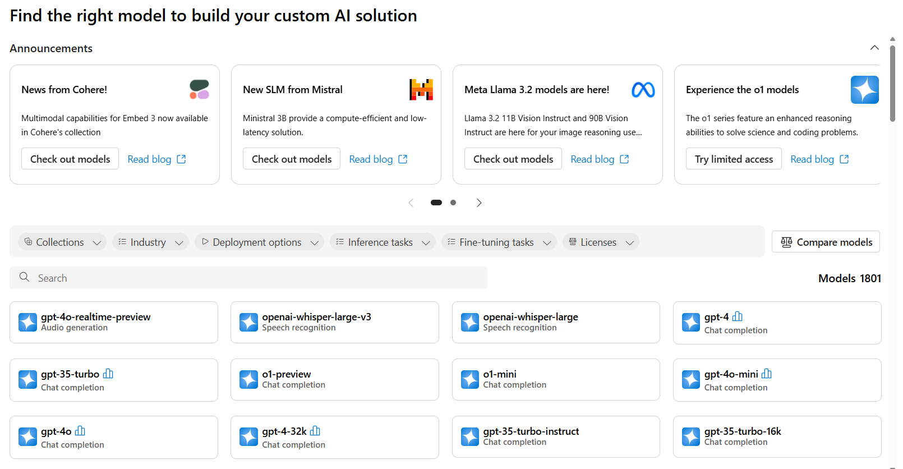
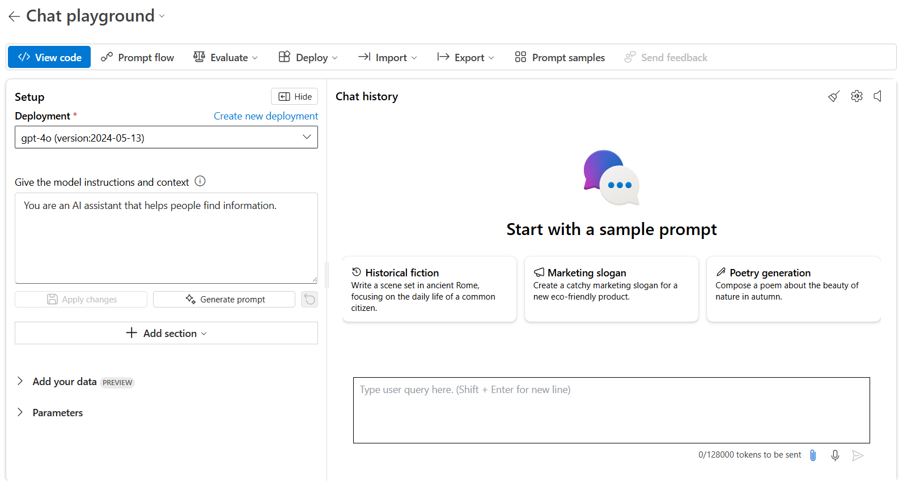

# Demo 1 - Get Started with Azure AI Foundry

The goal of this demo is to get familiar with the main features of Azure AI Foundry Portal. Before starting, make sure you completed the [Setup](set_up.md) steps.

At the top of the landing page, that you can access by navigating to [Azure AI Foundry Portal landing page](https://ai.azure.com), you can see the project and the hub you created in the setup phase. Here you can also find quick access buttons to the UIs to  manage and work with Azure OpenAI and Azure AI service resources deployed within your subscription. 
Scrolling down, you'll see additional features, enabling you to check and request compute and models quota as well as to safeguard your system with mitigation facilities.

## Hub overview

First thing first, explore the hub you created in the setup phase. You can visualize the *Hub overview* by simply clicking on your hub's name.

 This will open the *Management center*, where you can see and manage the main components of the hub:

- **Projects**: A project is a resource within Azure AI Foundry that grants you access to most of the platform's features, such as the **Playgrounds**. 
- **Description**: A short description of the Azure AI Foundry Hub you are in.
- **Hub Properties**: A collection of various properties such as the Hub's name, its location, resource group, etc. Here you can find useful information such as *API endpoints and keys* and the *subscription's quota*.
- **Connected Resources**: Azure AI Foundry allows for multiple resources to be connected to it, expanding its features and functionality. Resources such as Azure AI Search and Azure AI Service in this case further increase the capabilities of our Hub, and grant you access to deployments such as LLMs or functionalities such as vector search.
- **Permissions**: Allows you to grant access to collaborators or applications that may need to use the services within the Hub.

Next, click on the project you created in the setup phase, to have a deep dive into its properties and assets. From here, get started with your Azure AI Foundry tour by clicking on the *Go to project* button in the left-hand menu. By doing so, you will leave the management center and you'll get a different navigation bar with several tabs representing functionalities tied to your project. Go through each of them to get a better understanding of what you can do with Azure AI Foundry.

## Define and explore

- The **Model Catalog** provides 1.8K+ open source and prioprietary models inside Azure AI Studio. You can filter models by provider, task, license or just type the model name in the search bar.

> [!TIP] 
> Search for one of the small language models from the *Phi-3* family, such as *Phi-3-mini*. Go through the model card to learn about training dataset, intended use cases and deployments options. Test it, by using the *Try it out* feature.
- **Model Benchmarks**: If you click on this tab, you can compare benchmarks across models and datasets available, with charts on accuracy, similarity, fluency, coherence, etc.
- **AI Services**: In the AI Services tab you can see a list of Azure AI Services available, along with demos, use cases and more.

### Project Playgrounds

The *Playgrounds* section is where you can interact with the gpt models you have deployed in the setup phase. Each option represents a different approach to interacting and using AI models, and each playground mode is designed for a specific use case. For example the **Images** playground is designed for image generation tasks, while the **Language** playground is designed for text generation tasks.
In addition to that, the **Chat** playground allows you to create a quick prototype of a multimodal copilot, that you can customize, evaluate and deploy as a web app.
You are going to use this Playground in the following demo.

## Build and customize
- **Code**: work directly in code by exploring the Azure AI samples gallery, where you can find code snippets and examples to get started with your projects.
- **Fine-tuning**: you can optimize pre-trained models for specific tasks, by training it on a smaller, task specific dataset to improve its performance and accuracy.
- **Prompt Flow**: create, iterate and debug complex AI workflows, by chaining together multiple models and services in a single pipeline.

## Assess and improve
- **Tracing**: create traces to view performance and debug your applications using Application Insights.
- **Evaluation**: evaluate your generative AI app quality and safety with industry standard metrics to compare and choose the best version based on your need.
- **Content filters**: implement safety and security mitigations to operationalize responsible AI practices.