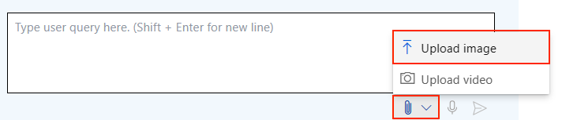
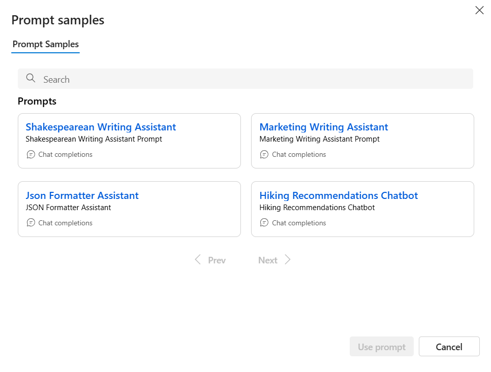

# Demo 2 - Prompt Engineering Techniques in the Azure AI Foundry Playground

The goal of this demo is to experiment with prompt engineering techniques in the Playground of Azure AI Foundry. Before starting, make sure you completed the [Setup](set_up.md) steps. Also, if you are not familiar with Azure AI Foundry yet, we recommend you to go through the [Get Started with Azure AI Foundry](demo1_get_started.md) demo first.

## Text generation

Navigate to the *Chat Playground* in your project, and make sure you have the following configurations:

- **Deployment**: gpt-4o
- **System message**:

```
## Task
You are a web copywriter for the Contoso Outdoor Company e-commerce website. Your goal is to generate the website copy for the homepage. 
Your answer should be brief and engaging. Always use a friendly and professional tone of voice.
Always show the word CONTOSO in capital letters.

## Safety
In the copy you write always stick to the subject of the company and the products it offers. Avoid any irrelevant information and controversial opinions.
```

Leave the other settings as default.

The deployment you selected is the chat engine that will generate an answer for you. [Gpt-4o](https://learn.microsoft.com/azure/ai-services/openai/concepts/models?WT.mc_id=academic-140829-cacaste#gpt-4o-and-gpt-4-turbo) is one of the latest models within the OpenAI family, which is able to process **multimodal** prompts and generate an answer accordingly.

The system message is a component of the prompt that is used to provide the model **instructions** about how it should behave and any relevant context. In this case, you are providing the model with the task it should perform and the safety guidelines it should follow.

> [!NOTE]
> Every time you edit the system message, make sure you click on the *Apply Changes* button to save the changes.


Let's start with **basic prompting**. In the *User message* field, type the following prompt:

```
Suggest a tagline for the website landing page.
```

In a few seconds, you should get a short tagline suggestion. Note how the model uses the context and guidelines provided in the system message to generate a relevant answer.

Let's make it better. Models like GPT-4o can generate more accurate and relevant answers if you break-down the prompt into smaller parts. Clear chat and then try the following user prompt:

```
- Write a short welcome message for the homepage, specifying the company name and the main value proposition.
- Write a brief description of the business, including the categories of products offered.
- Write a short description for each of the following product categories: tents, backpacks, hiking clothing, sleeping bags.
```

Compare the result with the previous one. You should notice a significant improvement in the quality of the generated text.

Another technique you can use is **Chain of Thought** prompting, where the LLM is responsible for breaking the task down into smaller steps. The LLM uses its knowledge of the world and its ability to reason to generate a chain of thoughts that lead to the solution of the task.
Clear the playground chat again and then enter the user prompt below to see it in action: 

```
Take a step-by-step approach in your response, include a welcome message, a brief description of the business, and a description of the product categories offered (tents, backpacks, hiking clothing, sleeping bags). Also, give reasoning before sharing the final answer in the below format: ANSWER is: <website copy>.
```

Let's go ahead and make the model generates a list of product names to add to the website copy. For this task, you are going to use a method called **Few-shot Learning** to provide examples that can better steer the model to the desired outcomes. Use the following user prompt:

```
Create a list of 10 product names the Contoso Outdoor shop might sell, include the type of item.

Examples:  
RidgeRunner Pro Trekking Poles: EQUIPMENT  
SummitShield 3-Season Tent: EQUIPMENT  
CascadeTech StormProof Jacket: APPAREL  
TerraFirm 40L Daypack: EQUIPMENT  
AlpineGlow Solar Lantern: EQUIPMENT
```

## Multimodal prompting

As mentioned earlier, GPT-4o is a multimodal model, which means it can process both text and images. Let's see how it works with a combination of an image and a textual prompt.

First thing first, change the system message to:

```
## Task
You are a web designer for the Contoso Outdoor Company e-commerce website. Your goal is to generate the website code snippets for the homepage GUI.
```

Then clear the chat and upload the image of the Contoso e-commerce hand-drown sketch from the `media` folder, by clicking on the attachemnt icon. You can find the image [here](./media/contoso_layout_sketch.jpg).



Couple the image with the following text prompt:

```
Generate the html and bootstrap code to implement the UI of the e-commerce landing page, based on the hand-drawn sketches in the image.
```

The outcome should provide a basic layout for the landing page of Contoso Outdoor Company. It includes placeholders for product descriptions.

> [!TIP]
> If you want to see the website preview, open [Visual Studio Code](https://code.visualstudio.com/Download) and copy paste the model answer into a new html file. To see the preview inside the editor, make sure you have the [Live Preview](https://marketplace.visualstudio.com/items?itemName=ms-vscode.live-server) extension installed.

## Prompt Catalog

For this demo you used some prompts built from scratch. However, Azure AI Foundry provides a prompt catalog with a collection of pre-built prompts that you can use to perform several task. You can access the Prompt Catalog by clicking on the *Prompt samples* button in the top menu of the Chat Playground.

Try to open one of the sample prompts. You'll see that each prompt has several components, such as system message, variables, and examples. You can use these prompts as a starting point to build your own and even test them in the Playground.

