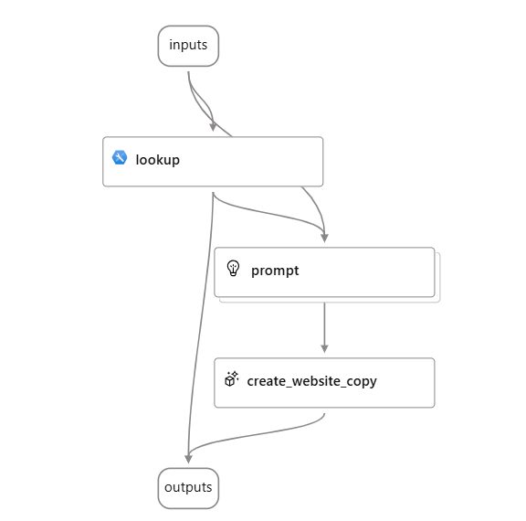
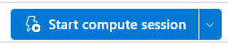
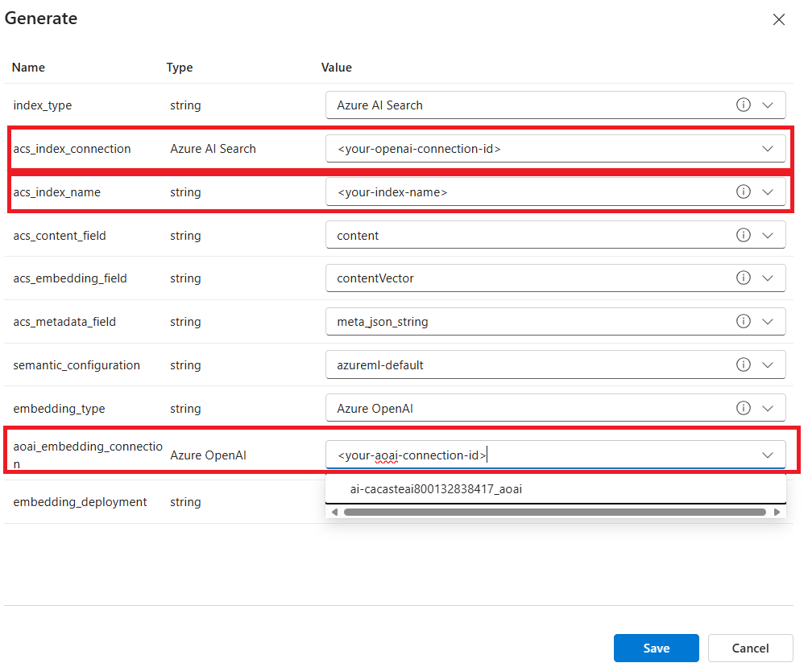
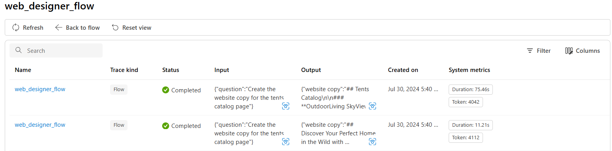
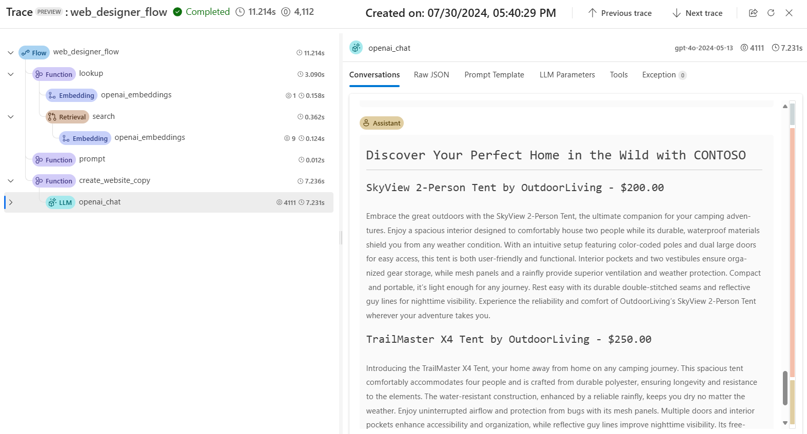

# Demo 3 - Add your own data with Prompt Flow

In the previous demo you discovered the Playground and interacted with the model through the chat interface. In this demo, you will learn how to build your first [DAG flow](https://microsoft.github.io/promptflow/how-to-guides/develop-a-dag-flow/?WT.mc_id=academic-140829-cacaste) in [Prompt Flow](https://learn.microsoft.com/azure/ai-studio/how-to/prompt-flow?WT.mc_id=academic-140829-cacaste) and connect it to your business data, to provide accurate responses grounded on your data sources.

## Add your data to Azure AI Studio Hub

In the [setup](./media/set_up.md) section, you created an Azure AI Search service and connected it to your Azure AI Studio hub. Now you will populate your Azure AI Search service with your business data.

Let's start by adding a new data source to your Azure AI Studio Hub.

1. Download the [Contoso products Catalog](./data/products.csv) csv file, a sample dataset that contains product information.
1. Go to the Azure AI Studio Hub and click on the **Data** tab.
1. Click on the **+ New data** button to create a new data source.
1. In the Add your data wizard, expand the drop-down menu to select **Upload files/folders**.
1. Select the **Upload file** and then the *product.csv* file from your local path. 
1. Name the data source and wait for the file to be uploaded.

Next, you will create a new index in your Azure AI Search service to store the product data and make it searchable.

1. Go to **Search** tab in the Azure AI Studio Hub.
1. Click on the **+ New index** button.
1. Select **Data in Azure AI Studio** as the data source and then the data source you just uploaded.
1. In the **Index Settings** section, select the *AzureAISearch* connection you created in the setup phase
1. In the **Search Setting** section, make sure that vectorization is enabled and select the default Azure OpenAI resource for your hub as *embedding* model.

Wait for the indexing process to be completed, which can take several minutes. The index creation operation consists of the following jobs:

- Crack, chunk, and embed the text tokens in your products data.
- Create the Azure AI Search index.
- Register the index asset.

## Build your first DAG flow

Now that your index has been registered in your Azure AI Studio project and is ready to be used, you can build your first DAG flow to interact with your data.

When you create a new flow, you are asked to choose a template for your DAG flow and you are going to import the one provided in the [web_designer_flow](./web_designer_flow) folder of this repository.

So to start, download the [web_designer_flow](./web_designer_flow) folder from the repository.
This folder contains:

- A **flow.dag.yaml** file that defines the structure of the flow. Note that it contains a few placeholders that you need to update once you import the flow in the Azure AI Studio project.
- A few **.jinja2** files that define the prompts and variants used in the flow.

Next, go to the **Prompt Flow** tab in your Azure AI Studio Project and click on the **+ Create** button. Scroll down to the *Import* section, and click on **Upload from local**. Then select the *web_designer_flow* folder you just downloaded, provide a name for your flow and click on **Upload**.

The imported flow should look like this:

The flow includes:

1. An **Input** node that collects the user question.
1. A **Lookup** tool that retrieves the product information from the Azure AI Search index, starting from the user query, to provide context to the model.
1. A **Prompt** node that combines a system message with the retrieved context and the user question provided in input. 
1. An **LLM** tool that generates a response based on the prompt and the context.
1. An **Output** node that includes the model response and the product search result.

First thing first, you need to click on the **Start compute session** button in the top right corner. This will start the compute session and allow you to apply edits to the flow.

Update the flow as follows:

- In the *inputs* node, add this string as question value: "Create the website copy for the tents catalog page".
- In the *lookup* node, click on the **Validate and parse input** button, and then update the *mlindex_content* value by replacing the placeholders for acs_index_connection, acs_index_name and aoai_embedding_connection with the actual values. Note that, by clicking on each value field, you'll get a list of options available in your project.

- In the *prompt* node, click on the **Validate and parse input** button. Click on the *Show variants* button to see the other prompt option available in the flow, and on the *Generate variants* if you'd like to create new ones using your Azure OpenAI connection. The benefit of using variants is that you can test different prompts in one execution and see which one performs better.
- Finally, in the *create_website_copy* node, click on the **Validate and parse input** button and then update the connection name with your Azure OpenAI service endpoint. Also, make sure the *Api* field is set to *Chat* and the *deployment_name* field is set to *gtp-4o*.

Once you are done with the edits, click on **Save** and then on the **Run** button to execute the flow. 
After a few seconds, by clicking on the **View test results** button, you should see the flow traces, one per each prompt variant. 

Click on one of the two to investigate the flow trace and see each node output. The final output of the flow should be similar to the one below:

Differently from the results we got by interacting with the model in the Playground, you can see as this answer is grounded in the products catalog information you uploaded in your Azure AI Studio project. Your flow used the user query to retrieve the product information relevant to the *tents page* and then used it to ground the final output.

This is a simple example of a DAG flow that connects to your business data, but you can build more complex flows by adding more nodes and connections. For example, you can add a [Python tool](https://learn.microsoft.com/azure/ai-studio/how-to/prompt-flow-tools/python-tool?WT.mc_id=academic-140829-cacaste) to your flow to perform custom operations on your data, format your output as needed or integrate with 3rd party services. 