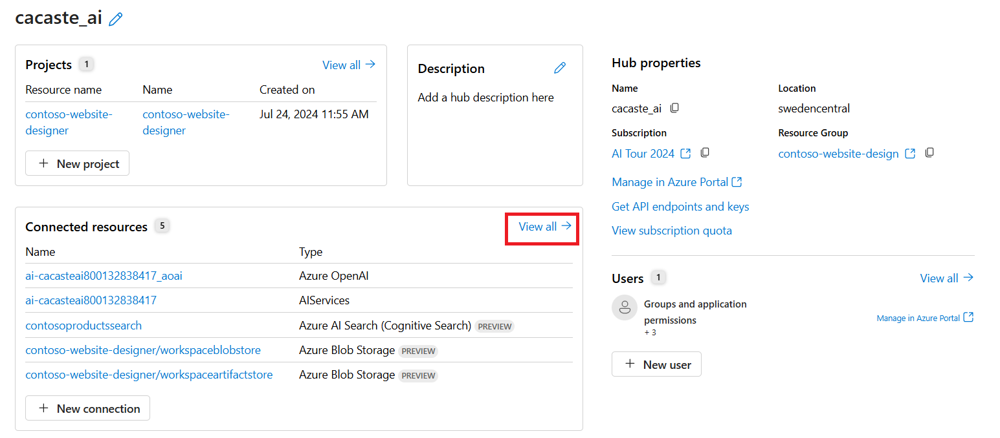
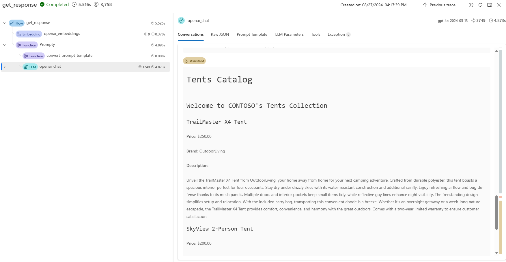

# Demo 3 - Add your own data with Prompt Flow and Prompty

In the previous demo you discovered the Playground and interacted with the model through the chat interface. In this demo, you will learn how to build your first gen AI application with [Prompt Flow](https://learn.microsoft.com/azure/ai-studio/how-to/prompt-flow?WT.mc_id=academic-145965-cacaste) and [Prompty](https://prompty.ai/) and connect it to your business data, to provide accurate responses grounded on your data sources.

In addition to the general pre-requisites defined in the [setup](./set_up.md) guidance, you need to install some additional dependencies to be able to execute your application flow.

1. Verify you have Python3 installed on your machine.
2. Install dependecies with `pip install -r requirements.txt`.
3. Install the [promptflow VS Code extension](https://marketplace.visualstudio.com/items?itemName=prompt-flow.prompt-flow).

If you prefer, you can also rely on a pre-built environment which has all the dependecies already installed for you. Just click the button below to open this repo into a [GitHub Codespace](https://github.com/codespaces).

 

## Add your data to Azure AI Studio Hub

In the [setup](./media/set_up.md) section, you created an Azure AI Search service and connected it to your Azure AI Studio hub. Now you will populate your Azure AI Search service with your business data.

Let's start by adding a new data source to your Azure AI Studio Hub.

1. Download the [Contoso products Catalog](./data/products.csv) csv file, a sample dataset that contains product information.
1. Go to the Azure AI Studio Hub and click on the **Data** tab.
1. Click on the **+ New data** button to create a new data source.
1. In the Add your data wizard, expand the drop-down menu to select **Upload files/folders**.
1. Select the **Upload file** and then the *product.csv* file from your local path. 
1. Name the data source and wait for the file to be uploaded.

Next, you will create a new index in your Azure AI Search service to store the product data and make it searchable.

1. Go to **Search** tab in the Azure AI Studio Hub.
1. Click on the **+ New index** button.
1. Select **Data in Azure AI Studio** as the data source and then the data source you just uploaded.
1. In the **Index Settings** section, select the *AzureAISearch* connection you created in the setup phase
1. In the **Search Setting** section, make sure that vectorization is enabled and select the default Azure OpenAI resource for your hub as *embedding* model.

Wait for the indexing process to be completed, which can take several minutes. The index creation operation consists of the following jobs:

- Crack, chunk, and embed the text tokens in your products data.
- Create the Azure AI Search index.
- Register the index asset.

## Explore your first gen AI solution

Now that your index has been registered in your Azure AI Studio project and is ready to be used, you can explore and test your first LLMs-based solution to interact with your data.

All the app source code is stored in the [web_designer_flow](./src/web_designer_flow) folder. It includes:
- The **flow.flex.yaml** file that defines the structure of the application flow, such as the input parameters and the function entry point. 
- The **create_website_copy.prompty** file that defines the model configuration and the prompt specification. [Prompty](https://prompty.ai/docs) is an asset class and format to enhance prompt engineering, especially useful to build complex prompts made up of dynamic components (data sources, conversation history and more).
- The **create_website_copy_request.py** file that contains the application logic, which is responsible for:
    1. converting the user query into a vector embedding using text-embedding-ada-002 model
    1. using the question in raw text and its embedding to perform a [hybrid search](https://learn.microsoft.com/azure/search/hybrid-search-overview?WT.mc_id=academic-145965-cacaste) in the product catalog index and retrieve the context
    1. loading the prompty file, and use it to combine the system prompt with the user query and the context retrieved to build the final prompt.
    1. using that prompt to generate the final response using the gpt-4o model instance.
- The **requirements.txt** file that includes all the dependencies needed to run the application flow.

To execute your application, you need to specify your **environment variables**. Copy the [.env.sample](./src/.env.sample) into a new file named *.env* and fill it out with the details of the resources provisioned during the set-up. To find up your resources credentials navigate to [Azure AI Studio](ai.azure.com) and from the left-side menu select *All hubs*. Pick the Azure AI hub you created during the set-up process and in the overview tab expand the *Connected resources* pane, by clicking on *View All*. From there, you'll be able to see and extract the information needed:

Then, use the command below to execute your flow, with a sample question: `pf flow test --flow ./web_designer_flex_flow --inputs question="Create the website copy for the tents catalog page"`.
After a few seconds, you should get a link to check the app traces UI. Click on it to see the execution details and the response generated by the model, as per screenshot below:

Differently from the results we got by interacting with the model in the Playground, you can see as this answer is grounded in the products catalog information you uploaded in your Azure AI Studio project. Your application used the user query to retrieve the product information relevant to the tents page and then used it to ground the final output.
