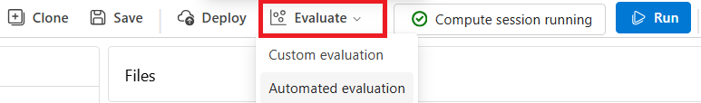
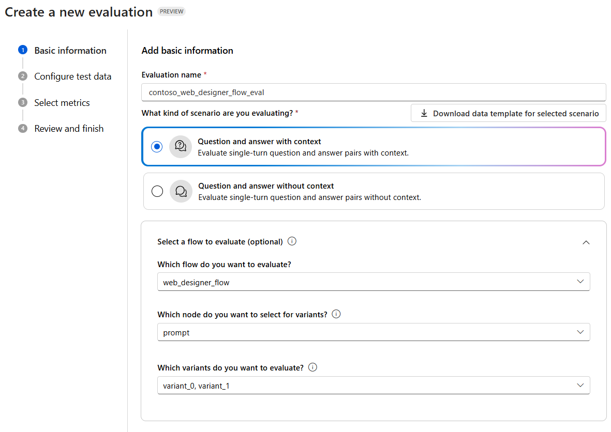
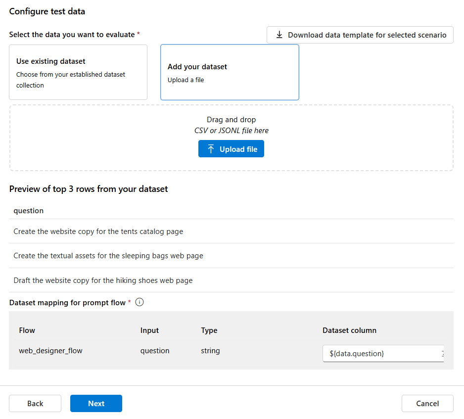
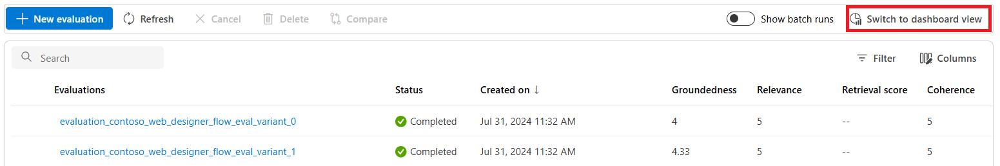
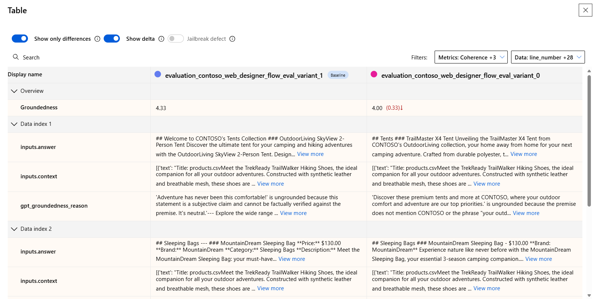

# Demo 4 - Evaluate your prototype with Prompt Flow

The goal of this demo is to evaluate the performance of the prototype you built in the [previous demo](./demo3_add_your_own_data_w_pf.md). Prompt Flow provides the ability to use AI-assisted evaluation tools to score the **generation quality** of your model. A common issue with generative AI models is that there's no ground truth to compare the generated text against, because they are non-deterministic. 

Prompt Flow helps you to overcome this limitation by instructing a second model of your choice - you are going to use *gpt-4* - to evaluate the input-output pairs generated by your flow, against pre-defined metrics.

## Evaluate the performance of your flow

The first thing you need to evaluate your flow is a test dataset. You can download the [sample dataset](./data/test_dataset.jsonl) provided in the data folder of this repository. 
From the flow you built in the previous demo, click on the *Evaluate* button and then select **Automated evaluation**.

In the *Create a new evaluation* wizard, choose a name for your evaluation flow and make sure that the scenario is set to *Question and answer with context* and that the selected flow to evaluate is set to the one you built in the previous demo.

In the next step, you need to upload the test dataset you downloaded. Click on *Add your dataset* and then on *Upload file* to select the local jsonl file.

Then, select the metrics you want to use to evaluate your flow: *groundedness, relevance, coherence, and fluency*. If you are not familiar with these metrics you can read more about them in the [evaluation metrics documentation](https://learn.microsoft.com/azure/ai-studio/concepts/evaluation-metrics-built-in?WT.mc_id=academic-140829-cacaste).

Select your project Azure OpenAI connection to use to compute the metrics and make sure you select gpt-4 as the model instance to use for the evaluation.

Finally, map the evaluation inputs as follow:

- *Context* should be mapped to ${run.outputs.context}
- *Answer* should be to ${run.outputs.website copy}
- *Question* should be to ${data.question}

Review and submit the evaluation. The evaluation process can take a few minutes to complete. Once it's done, you can review the evaluation results and the metrics computed for your flow.

## Review evaluation results

The evaluation results includes an aggreagated average score for each metric across the whole dataset, in a range from 0 to 5. In addition to that, you can inspect the score for each individual input-output pair in the dataset, to understand where your flow is performing well and where it needs improvement.

You will see a different evaluation results report per each prompt variant. If you wish to compare the two in a single view, you can click on the *Switch to dashboard view* button in the right corner. 

Make the evaluation results for the two variants visible by clicking on the *eye* icon. this will open the comparison view for the two evaluations.
