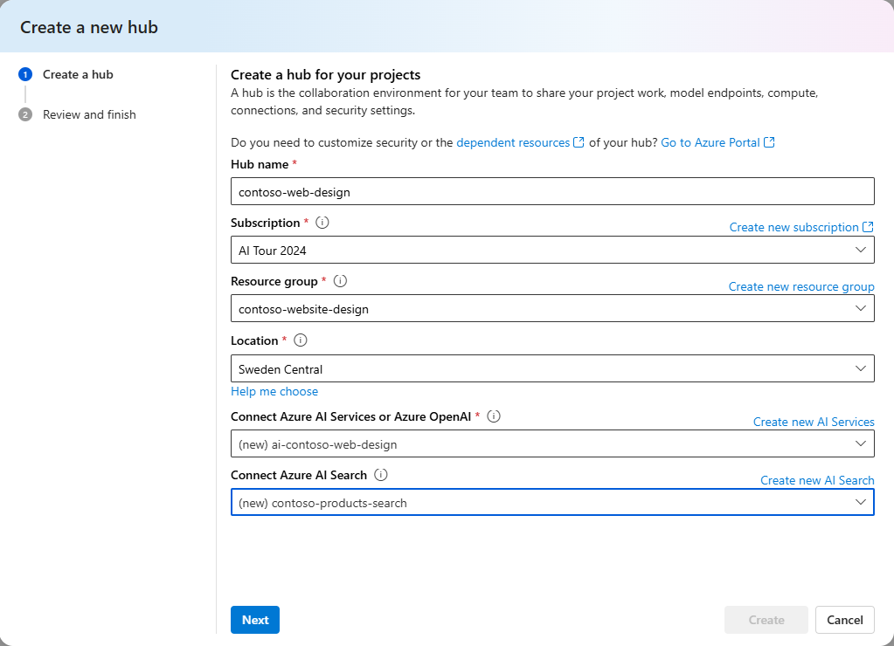
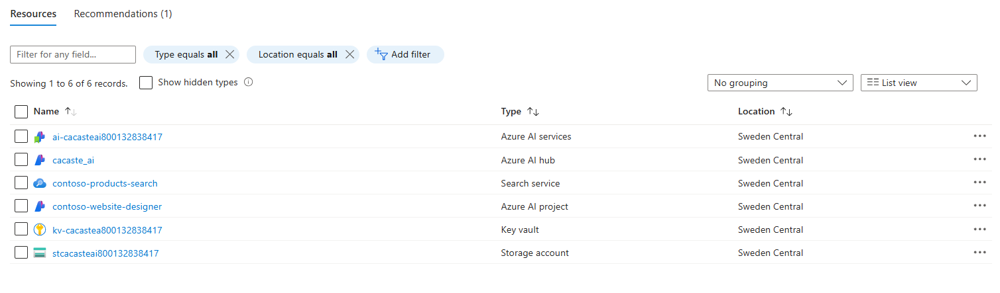

# Demo Setup - Azure Portal and Azure CLI


## Demo Prerequistes: 

- You will need an Azure account.  If you don't have an Azure account, you can create one for free [here](https://azure.microsoft.com/en-us/free/).

- Make sure that you have capacity for the OpenAI resources you are creating in your Azure subscription.  Note that not all OpenAI resources are available in all regions, so make sure to check availability and choose a region that supports this demo, specifically the gpt-4o, gpt-4 turbo and text-embedding-ada-002 models.
For more information, see [https://learn.microsoft.com/azure/ai-services/openai/overview](https://learn.microsoft.com/azure/ai-services/openai/overview).

- You will need an IDE to build and test your first LLMs-based application. You can choose to work on your local [Visual Studio Code](https://code.visualstudio.com/) desktop app or run a [GitHub Codespace](https://github.com/features/codespaces) in the browser. You can click on the button below to open this repo in a GitHub Codespace.

 [](https://github.com/codespaces/new?hide_repo_select=true&machine=basicLinux32gb&repo=826287138&ref=main&devcontainer_path=.devcontainer%2Fdevcontainer.json&geo=UsEast)

> [!NOTE] 
> OpenAI resources are amazing but can be EXPENSIVE!  Make sure you review the costs associated with the OpenAI resources that you are creating.

## Option 1: Set up the demos using the Azure Portal and the Azure AI Foundry Portal

Follow the steps below to set up the Azure AI Foundry environment for this demo.

1. Navigate to [Azure AI Foundry](ai.azure.com) and login with your Azure account. 
1. Click on *+ Create project* on the top right corner of the homepage to create a new project. A project is a resource within Azure AI Foundry that grants you access to most of the platform's features, such as the Playgrounds.
1. In the *Create a project* configuration window, type a name for your new project, then click on *Create a new hub* to add a name for a new hub too. A hub provides a collaborative workspace to host your projects
1. Next, click on *Customize* to set up additional configurations related to your new hub, such as subscription, resource group and location. The recommended location for running this demo is **Sweden Central**, for the sake of models availability. Create a new Azure AI services to enable access to Azure OpenAI Service and an AI Search service to enable the search functionality.

1. In your newly created project, navigate to the *Models + endpoints* page, under *My assets* section. Click on *+ Create deployment* to create a new deployment. For this demo you'll need 3 gpt instances: *gpt-4o*, *gpt-4* and *text-embedding-ada-002*. This is how your project's deployments section should look like:

At the end of this step, if you navigate to the [Azure Portal](portal.azure.com) your project resource group should look like this:

where the key vault and the storage account are created by default when you create a new Azure AI Studio hub.

## Option 2: Azure CLI Automation Script

*Warning:* An .env file with hard-coded values for local demos and testing will be created in the src directory.
This file is used to store the environment variables for the project for demos and testing only.
Please do not share this file, or commit this file to the repository.
Delete this file when done with demos, or if you are not using it.


### Azure CLI Prerequisites

- The Azure CLI must be installed, or you can use GitHub Codespaces or the Azure Cloud Shell.  Get the Azure CLI at [https://docs.microsoft.com/cli/azure/install-azure-cli](https://docs.microsoft.com/cli/azure/install-azure-cli?WT.mc_id=academic-145965-cacaste). If you are not using the Azure Cloud Shell, you should login from the terminal to the Azure subscription where you want to provision the Azure AI resources. Use the following command to sign in:
```bash
az login --use-device-code
```
- You can use the included CLI in GitHub Codespaces to run the script in a browser-based environment.  For more information, see [https://docs.github.com/codespaces](https://docs.github.com/codespaces). 
- You can also use the included CLI in the Azure Cloud Shell to run the script in a browser-based environment.  For more information, see [https://docs.microsoft.com/azure/cloud-shell/overview](https://docs.microsoft.com/en-us/azure/cloud-shell/overview).
- The extension for Azure Machine Learning must be installed.  See [https://docs.microsoft.com/azure/machine-learning/how-to-configure-cli](https://docs.microsoft.com/en-us/azure/machine-learning/how-to-configure-cli) for configuration instructions.

To install the Azure Machine Learning extension, run:
```bash
az extension add --name ml
```
>[!NOTE]
>If you are using GitHub Codespaces, the Azure Machine Learning extension is already installed.


### Usage

### 1. Customize the location:

Replace the `location`: with your preferred Azure region (Default: eastus).

### 2. Run the Script

1. Make the script executable:
   ```bash
   chmod +x set_up.sh
   ```
2. Run the script:
   ```bash
   ./set_up.sh
   ```
